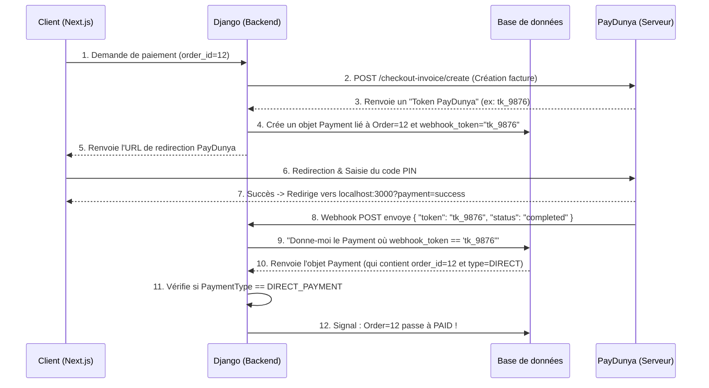

# Workflow Complet : Architecture du Paiement PayDunya

Vous avez posé une excellente question d'architecture : **Comment le backend Django sait-il exactement quelle commande modifier alors que PayDunya ne renvoie pas l'ID de la commande, et comment différencions-nous une recharge de Wallet d'un paiement direct ?**

Voici l'explication méticuleuse, étape par étape, de la mécanique interne de votre système.

---

## 1. Le Schéma Graphique (Architecture de l'Idempotence)

Voici le diagramme séquentiel visuel de ce qui se passe sous le capot entre Next.js, Django et PayDunya :



---

## 2. Explication Ligne par Ligne (Comment le lien se fait)

### A. L'astuce du `webhook_token` (L'empreinte digitale)
Puisque PayDunya ne connaît pas vos commandes, **Django utilise le système de Token de Facture comme pont (Bridge).**

Lorsque le frontend demande d'initier un paiement, Django appelle l'API PayDunya `invoice.create()`. PayDunya répond avec un token unique pour cette facture (ex: `tk_9876`).
À cet instant précis, votre backend sauvegarde ce token dans le modèle `Payment` de votre base de données :

```python
# Dans apps/paiements/services.py (initiate_direct_payment)
payment = Payment.objects.create(
    order=order, # On lie la commande
    provider=Payment.Provider.PAYDUNYA,
    payment_type=Payment.PaymentType.DIRECT_PAYMENT, # <--- ON PRÉCISE LE TYPE
    amount=amount,
    reference_externe=token, # <--- L'EMPREINTE
    webhook_token=token,     # <--- L'EMPREINTE
)
```
C'est ici que la magie s'opère : **Django vient d'associer la Commande, le Type (Paiement Direct) et le Token PayDunya dans une seule ligne de la base de données.**

### B. La réception du Webhook
Quand le client valide son paiement sur son téléphone, PayDunya envoie un webhook à votre URL ngrok. Le payload ressemble à ça :
```json
{
  "token": "tk_9876",
  "status": "completed"
}
```

### C. La résolution (Retrouver la commande)
Dans `PaymentService.handle_webhook()`, voici la ligne exacte qui retrouve votre commande sans que PayDunya ne l'ait mentionnée :
```python
# Django cherche le paiement qui possède ce fameux token
existing_payment = Payment.objects.filter(webhook_token="tk_9876").first()
```
Puisque ce `existing_payment` a été créé à l'étape A, Django sait immédiatement que `existing_payment.order` est la commande n°12 et que `existing_payment.payment_type` est un paiement direct !

### D. Le Signal de Validation
Vous avez eu parfaitement raison concernant la vérification du type de paiement. J'ai donc modifié le signal dans `apps/paiements/signals.py` pour ajouter cette sécurité stricte :

```python
@receiver(post_save, sender=Payment)
def update_order_status_on_payment_success(sender, instance, created, **kwargs):
    # 1. On vérifie que la transaction de paiement est "SUCCESS"
    # 2. On vérifie MÉTICULEUSEMENT qu'il s'agit d'un paiement de commande
    if instance.status == Payment.Status.SUCCESS and instance.payment_type == Payment.PaymentType.DIRECT_PAYMENT:
        
        # On s'assure qu'il y a bien une commande liée et qu'elle n'est pas déjà payée
        if instance.order and instance.order.status != OrderStatus.PAID:
            
            # On met à jour le statut
            instance.order.status = OrderStatus.PAID
            instance.order.paid_at = timezone.now()
            
            # On sauvegarde en base de données
            instance.order.save(update_fields=["status", "paid_at"])
```

**Si c'était une recharge de Wallet** : Le `payment_type` serait `WALLET_TOPUP`. Le signal regarderait la condition, verrait que ce n'est pas `DIRECT_PAYMENT`, et **ne ferait absolument rien** concernant la commande. À la place, c'est le `PaymentService` qui prendra le relais pour ajouter les fonds au Wallet.

Tout est compartimenté, sécurisé et tracé !
